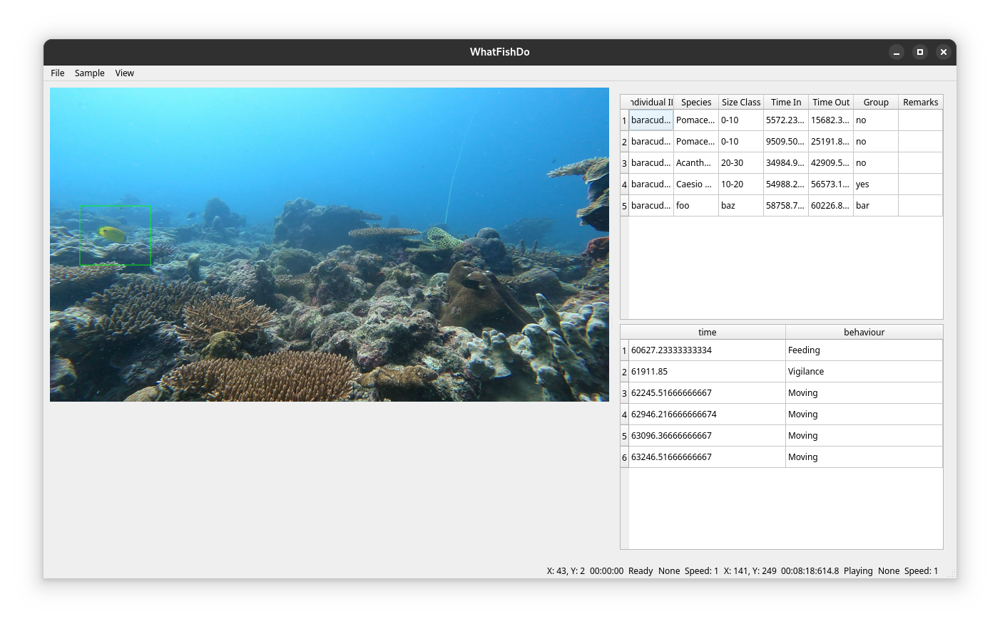

# WhatFishDo: A Behavior Annotation Tool for Videos Collected from the Field

## Overview

WhatFishDo is a tool designed to assist researchers in annotating behavior from video footage. The tool supports detection, tracking, and annotation of animals in videos, leveraging YOLO for detection and OpenCV for tracking. It also supports GPU acceleration for faster processing.



## Features

- **Detection**: Uses YOLO model to detect fish in video frames.
- **Tracking**: Tracks detected fish across frames using OpenCV trackers.
- **Annotation**: Allows users to annotate fish behavior by drawing bounding boxes and entering data.
- **GPU Acceleration**: Supports CUDA for faster processing on compatible hardware.
- **Session Management**: Supports resuming from previous sessions.

## Installation

### Prerequisites

- Python 3.13 or higher
- pip (Python package installer)

### Steps

1. **Clone the repository**:
    
    ```sh
    git clone https://github.com/yourusername/WhatFishDo.git
    cd WhatFishDo
    ```

2. **Install dependencies**:
    
    ```sh
    pip install -r requirements.txt
    ```

    **Note for GPU users**: You will need to compile OpenCV with CUDA support. Instructions can be found [here](https://gist.github.com/minhhieutruong0705/8f0ec70c400420e0007c15c98510f133). 

3. **Download YOLO model files**:
    - Download config and weights for a pretrained model of your choosing.
    - Place them in the `model/` directory of the project.
    - Rename them to `model.cfg` and `model.weights` respectively. 
    
    I recommend [YOLO-Fish](https://github.com/tamim662/YOLO-Fish/tree/main) for videos of fish in heterogeneous environments.

## Usage

### Command Line Arguments

- `-g, --gpu`: Run detection model with CUDA.
- `-d, --detect`: Run with detection model.
- `-t, --track`: Run with tracking algorithm.

### Running the Tool

I recommend using [`uv`](https://docs.astral.sh/uv/) package and environment manager. With `uv` you can simply use the following command to run the application:

```sh
uv run app.py
```

If you are on Windows, you can use the following command:

```sh
uv run app.py --with PyQt5 --with opencv-python-headless
```

If you are not using `uv`, you can run the application using the following command:

```sh
# create a virtual environment
python -m venv venv

# activate the virtual environment
source venv/bin/activate

# install the dependencies
pip install -r requirements.txt

# run the application
python app.py
```

### Key Bindings

- Press `[space]` to pause the video.
- Press `LEFT` to skip backward 1 second.
- Press `RIGHT` to skip forward 1 second.
- Press `UP` to skip forward 10 seconds.
- Press `DOWN` to skip backward 10 seconds.
- Press `j` to increase speed.
- Press `k` to decrease speed.
- Press `z` to stop the observation.
- Press `p` to record a predator in frame.

### Data and Images

Data and images are saved automatically in the data folder.

### Annotation

Click and drag to draw a bounding box around the fish and start an observation. Use the number keys to record the fish's behavior.

## Project Files

When creating a new project, you will be prompted to choose a model. This project supports two project models:

1. **Individual**: Each video in your dataset is a separate individual. This is appropriate for experimental studies and focal follows.
2. **Plot or Treatment**: Each folder in your dataset is a separate plot or treatment. This is appropriate for observational studies and in-situ experiments.

Project properties are stored in `.json` files in the project directory. You can edit these files to change the project settings.

## Subsampling

Having large datasets can be computationally expensive. You can specify the number of subsamples to use in the project settings. This will create random non-overlapping subsamples of the specified duration which are stored in project propertes file.

## Behavior Codes

You can specify an ethogram using a `.json` file. The file should cotain the key bindings follwed by names and types for each behavior. You can optionally add a description for each behavior. See the below example:

```json
{
    "1": {
        "name": "Feeding",
        "type": "Behavior",
        "description": "Fish is feeding on the substrate."
    },
    "2": {
        "name": "Resting",
        "type": "Behavior",
        "description": "Fish is resting on the substrate."
    },
    "3": {
        "name": "Swimming",
        "type": "Behavior",
        "description": "Fish is swimming in the water column."
    }
}
```

In the above example, `1`, `2`, and `3` are the key bindings for the behaviors. The names are the names of the behaviors, the type is the type of behavior, and the description is an optional description of the behavior.

## Size classes

You can specify size classes for the indiviudals in the dataset. This is useful for studies that require size-based analysis. You can specify the size classes in a `.json` file. See the below example:

```json
{"sizes": ["0-10", "10-20", "20-30", "30-40", "40-50", "50<"]}
```

## License

This project is licensed under the MIT License - see the [LICENSE](LICENSE) file for details.

## Acknowledgments

- [YOLO-Fish](https://github.com/tamim662/YOLO-Fish/tree/main) for the pretrained model.
- [OpenCV](https://opencv.org/) for the computer vision library.